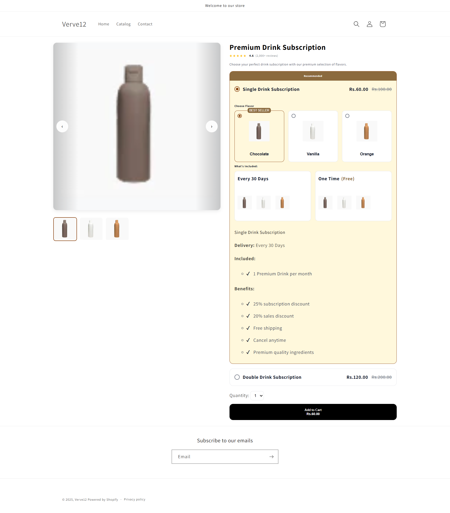

# Shopify Dynamic Product Page

This project is a fully functional, interactive, and responsive Shopify product page, designed for a modern e-commerce experience. The page allows customers to choose between single or double product subscriptions and select their preferred flavors dynamically.

---

## Live Demo

* **Live Store URL:** `https://verve12.myshopify.com/products/premium-drink-subscription`
* **Password:** `meegli`

---

## Features

The product page includes a rich set of features designed to provide an interactive and seamless user experience:

* **Product Media Gallery:** A product image carousel where thumbnail clicks dynamically update the main image. The gallery is variant-aware, updating images to reflect the selected flavor.
* **Dynamic Purchase Options:**
    * Two distinct purchase modes are available: "Single Drink Subscription" and "Double Drink Subscription," implemented as a radio button group.
    * Selecting a mode dynamically updates the entire UI, including the available flavor selectors and the total price.
* **Flavor Selection:**
    * Interactive image swatches for selecting flavors (Chocolate, Vanilla, Orange).
    * The "Single Drink" mode displays one flavor selector, while the "Double Drink" mode displays two separate selectors.
    * A flavor selection is required before adding items to the cart.
* **Dynamic Pricing & Discounts:**
    * All pricing is pulled directly from the Shopify backend, including `compare-at price` to display discounts.
    * The page reflects a subscription discount and a sales discount in its pricing structure.
    * Prices update in real-time based on user selections (e.g., switching from single to double mode).
* **"What's Included" Section:**
    * A contextual box that updates its content based on the selected purchase mode.
    * Displays delivery frequency, included items, and key benefits.
    * All content for this section is managed via custom metafields in the Shopify admin for easy updates.
* **AJAX Add to Cart:**
    * The page loads with default options pre-selected.
    * The "Add to Cart" button adds the correct product variant(s) to the cart without a page refresh.
    * For the "Double Drink" mode, the logic correctly adds two separate variants to the cart based on the user's two flavor selections.

---

## Technical Stack

* **Frontend:** HTML5, CSS/SCSS, JavaScript (ES6)
* **Shopify:** Liquid Templating, Shopify Product & Variant Objects, Metafields
* **APIs:** Shopify AJAX Cart API

---

## Data Structure & Setup Instructions

To ensure the page is fully dynamic, a specific data structure was created in the Shopify backend. To replicate this project, follow these setup steps:

1.  **Product Setup:**
    * Create a single product (e.g., "Protein Drink").
    * Add one **Option** named `Flavor` with the values `Chocolate`, `Vanilla`, and `Orange`. This will create three corresponding variants.

2.  **Variant Configuration:**
    * For each variant, set the **Price** and **Compare-at price** to reflect the discount structure. For example, for a final price of $6.00 after a 20% sale from an original subscription price of $7.50, set:
        * `Price`: `$6.00`
        * `Compare-at price`: `$7.50`
    * Assign the correct featured image to each variant (e.g., the chocolate bottle image for the Chocolate variant).

3.  **Metafields Setup:**
    * Navigate to **Settings** > **Custom data** > **Products**.
    * Create two **metafield** definitions:
        1.  **Name:** `Single Subscription Benefits`
            * **Namespace and key:** `custom.single_subscription_benefits`
            * **Type:** `Multi-line text`
        2.  **Name:** `Double Subscription Benefits`
            * **Namespace and key:** `custom.double_subscription_benefits`
            * **Type:** `Multi-line text`
    * On the product page in the Shopify admin, populate these metafields with the bullet-point text for each corresponding mode.

4.  **Template Installation:**
    * In your theme's code editor, create a new product template (`product.custom-template.liquid`).
    * Copy the code from this repository's `product.custom-template.liquid` file into your new template.
    * Copy the associated CSS/SCSS and JavaScript into your theme's asset files and ensure they are loaded.
    * Assign the new template to your product in the Shopify admin.

---

## Key Project Highlights

This project was built with a focus on modern development standards:

* **Design-Driven:** Built to be a pixel-perfect implementation of a high-fidelity design.
* **Backend Driven:** All pricing and variant information is sourced directly from the Shopify backend without hardcoding.
* **Code Quality:** Clean, maintainable, and well-documented Liquid, JS, and CSS code.
* **Performance & Responsiveness:** The page is mobile-first and optimized for performance.
* **Interactivity:** A high-quality, stateful, and interactive user interface.
